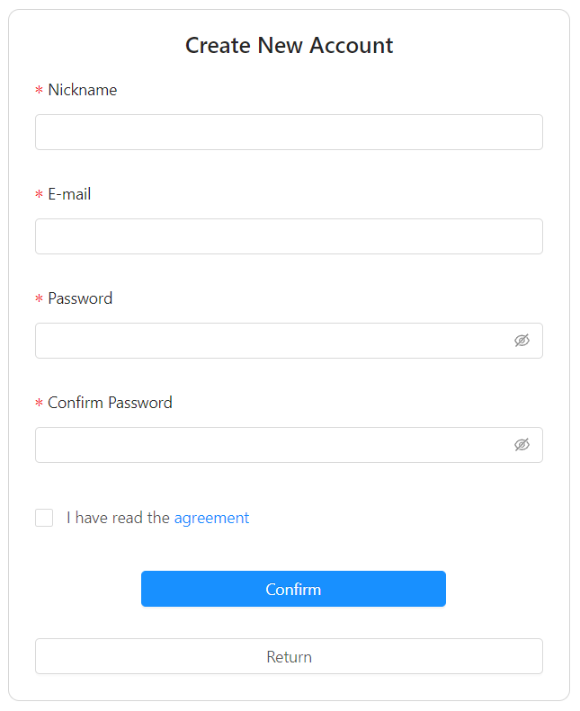

# UserSecurityModule-Client #
UserSecurityModule-Client is responsive frontend react component which allows the user to sign in, sign up and recover the password. In the future, it will be connected to the appropriate security backend server. The goal of this project is to create a security module for my future applications.

## Technology used :
###
  - JavaScript ES6
  - React
  - Redux
  - React Router

## Screenshots : 

